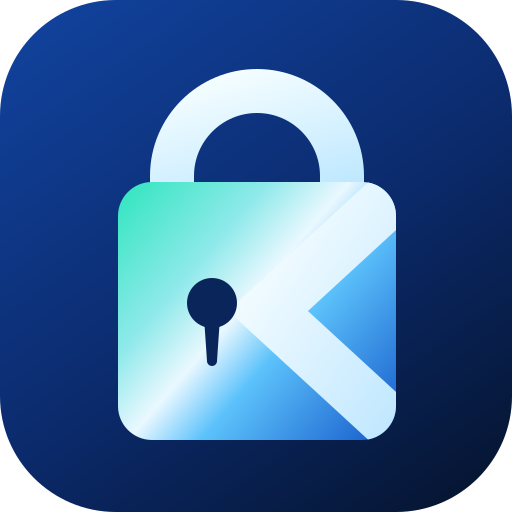

<div align="center">
  
  <h1>KalmPass</h1>
  <p><strong>A password manager that cannot read your passwords.</strong></p>
  <p><a href="https://kalmpass.net">kalmpass.net</a></p>
</div>

---

KalmPass is a zero-knowledge password manager running entirely on Cloudflare, a
Worker, a D1 database, and a static front end served from the edge. Vaults are
encrypted in the browser under a key derived from a master password that is never
transmitted, so the server stores ciphertext it has no means of reading.

It has **no runtime dependencies**. Not one. The whole thing is a few thousand
lines of TypeScript and plain ES modules you can read in an afternoon, which
matters more for a password manager than for almost anything else.

## How the encryption works

```
master password ──PBKDF2-SHA256 × 1,000,000 (salt: email)──▶ master key
                                                                │
                              HKDF "enc" ◀────────────────────┬─┘
                                   │                          │
                                   ▼                    HKDF "auth"
                            encryption key                    │
                                   │                          ▼
                                   │                     auth key ──▶ server
                                   │                  (proves identity;
                                   ▼                   cannot decrypt)
                          wraps the vault key
                                   │
                                   ▼
   vault key ──AES-256-GCM──▶ your items (padded to 256-byte blocks)
       ▲
       └── also wrapped by your Recovery Key (125 bits, saved offline)
```

Two independent secrets open a vault, the master password and the Recovery Key.
KalmPass holds neither. That is the whole design: recovery is possible for the
account holder without anyone escrowing a key on their behalf.

Everything the client sends is then encrypted **again** by the Worker under
`SERVER_KEY`, a secret that never enters the database. Email addresses are stored
as keyed blind indexes plus an encrypted copy, so the database holds no readable
identifier at all.

The full write-up lives at [kalmpass.net/security](https://kalmpass.net/security/)
and in [`public/security/index.html`](public/security/index.html).

## What is in the box

| | |
|---|---|
| **Vault** | Items with username, password, URL, notes, folders, favorites, password history |
| **Authenticator** | TOTP codes generated on-device from seeds stored inside the encrypted blob |
| **Generator** | Passwords and passphrases from `crypto.getRandomValues`, rejection-sampled to remove modulo bias, with honest entropy figures |
| **Health** | Weak, reused and stale passwords; breach checking via HIBP k-anonymity (Pro) |
| **Recovery** | Recovery Key / Emergency Kit, plus an email-verified account reset for people who lose both |
| **Accounts** | Signup, email confirmation, optional TOTP two-factor with backup codes, device list, activity log |
| **Billing** | Stripe Checkout and customer portal, subscription webhooks, server-enforced plan quotas |
| **Portability** | Encrypted JSON backups, CSV import from LastPass / Bitwarden / 1Password / Chrome |

## The browser extension

`extension/` is a Manifest V3 Chrome extension. It is not on the Web Store, so
it is side loaded:

1. Open `chrome://extensions`
2. Turn on **Developer mode**, top right
3. **Load unpacked**, and choose the `extension` folder

It asks for four permissions and no more: `storage`, `activeTab`,
`scripting` and `alarms`, plus host access to `kalmpass.net` alone. There is
deliberately no content script and no `<all_urls>`, so the extension runs no
code on any page until you press Fill, and it can never read a page you have
not pointed it at. Most password manager extensions ask for far more.

Keys live only in the service worker, held in `chrome.storage.session`, which
is memory backed and cleared when Chrome quits. The popup never receives a
secret unless you ask to copy that particular one, and filling happens in the
worker so a password reaches the page without passing through the popup at all.

The extension authenticates with a bearer token rather than the session cookie,
because a `SameSite=Strict` cookie will not travel from a `chrome-extension://`
origin. `npm run smoke` exercises that path end to end.

`extension/lib/` holds copies of the crypto modules, since an extension cannot
import from the website. `npm run lint:libs` fails the build if they drift.

## Repository layout

```
src/                  the Worker, no runtime dependencies
  index.ts            router; the only entry point
  crypto.ts           hashing, random, constant-time compare
  serverkey.ts        the server envelope (layer 2) and blind indexes
  sessions.ts         session tokens, scopes, device limits
  throttle.ts         login and recovery rate limiting
  accounts.ts         user row, plan and verification checks
  audit.ts            the account's own security log
  email.ts            transactional mail
  totp.ts             RFC 6238, for the second factor on login
  plans.ts            what Free and Pro allow
  routes/             account, items, billing, tools

public/               static, served from the edge
  index.html          marketing site
  security/ terms/ privacy/
  app/index.html      the vault
  js/crypto.js        client-side cryptography, the part that matters
  js/store.js         vault state; nothing is ever written to disk
  js/*.js             ui, generator, totp, health, settings
  _headers            CSP and the rest of the security headers

schema.sql            D1 schema, annotated
```

## Running it locally

```bash
npm install
npm run db:init:local
npm run dev
```

You will need a `.dev.vars` containing at least:

```
SERVER_KEY="<32 random bytes, base64>"
```

Generate one with:

```bash
node -e "console.log(require('crypto').randomBytes(32).toString('base64'))"
```

## Deploying

```bash
npm run db:init      # once, against the remote D1 database
npx wrangler secret put SERVER_KEY
npm run deploy
```

> **`SERVER_KEY` is not recoverable.** Every row in D1 is encrypted under a key
> derived from it. Lose it and the database becomes unreadable even to the people
> holding the right master passwords. Back it up somewhere other than this repo.
>
> It is *not* a backdoor: holding it still does not decrypt a vault, because the
> client layer sits underneath and needs a master password nobody else has.

### Secrets

| Name | Required | Purpose |
|---|---|---|
| `SERVER_KEY` | yes | Derives the envelope key, the hashing pepper and the email blind-index key |
| `SIGNUP_TOKEN` | no | Invite code gating registration. Delete it to open signups publicly |
| `STRIPE_SECRET_KEY` | for billing | Stripe API key |
| `STRIPE_WEBHOOK_SECRET` | for billing | Verifies webhook signatures |
| `STRIPE_PRICE_ID` | for billing | The Pro subscription price |

Non-secret settings (`APP_URL`, `MAIL_FROM`, `ALLOW_SIGNUP`) live in
`wrangler.jsonc`.

## Launch checklist

- [x] **Email sending.** Done. kalmpass.net is onboarded, and Cloudflare wrote
      the SPF, DKIM, DMARC and bounce MX records itself. Note that Email Sending
      needs the Workers Paid plan; on the free plan the dashboard offers no way
      to onboard a domain and the API answers Unauthorized, which reads as a
      permissions problem but is a billing one.
- [ ] **Stripe.** Create a Pro price, then set the three `STRIPE_*` secrets and
      point a webhook at `https://kalmpass.net/api/billing/webhook` for
      `checkout.session.completed`, `customer.subscription.*` and
      `invoice.payment_failed`.
- [x] **Open signups.** Done. Re-close them at any time by setting SIGNUP_TOKEN
      again, or ALLOW_SIGNUP to "false" in wrangler.jsonc.
- [ ] **Legal.** `public/terms/` and `public/privacy/` are drafts with bracketed
      placeholders. Have a solicitor review them before taking payment.
- [ ] **Price.** The £2/month on the landing page is a placeholder; it must match
      the Stripe price.

## What this does not protect against

Stated plainly, because a security product that only lists its strengths is not
being straight with you:

- **A compromised device.** Malware or a browser extension with page access can
  read a vault while it is unlocked.
- **A weak master password.** A million PBKDF2 rounds multiplies an attacker's
  cost; it does not rescue a guessable password.
- **A malicious server operator.** We cannot decrypt what has already been sent,
  but in principle we could serve altered JavaScript in future. That risk is
  inherent to every web-delivered password manager. It is why this code ships no
  third-party dependencies at all: there is no CDN, no analytics and no package
  that could be compromised to change what runs in the browser. Making the
  repository public would strengthen this further, by letting the served page be
  checked against the source.
- **Losing both the master password and the Recovery Key.** The data is then gone
  for good. That is the direct cost of nobody else holding a key.

## Security reports

Please email [security@kalmpass.net](mailto:security@kalmpass.net) before
disclosing publicly. Reports made in good faith will never be met with legal
threats.

## Licence

MIT. See [LICENSE](LICENSE).
